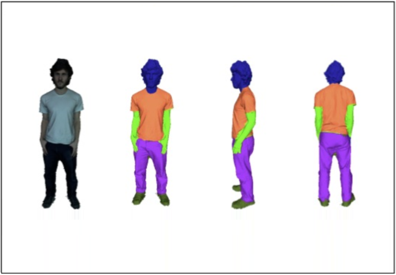

<!--author-->

# News
* [NEW] [April 2023] One Paper accepted by ACM SIGGRAPH 2023.
* [January 2023] One Paper accepted by ACM CHI 2023.
* [January 2023] One Paper accepted by IEEE VR 2023.
* [May 2022] Our SIGGRAPH 2022 paper "Interactive Augmented Reality Storytelling Guided by Scene Semantics" is featured on the <a href="https://blog.siggraph.org/2022/05/real-world-vs-ar-based-environments.html/" target="_blank">SIGGRAPH Blog</a>.
* [April 2022] One Paper accepted by ACM SIGGRAPH 2022.
* [August 2021] One Paper accepted by ACM SIGGRAPH Asia 2021.
* [April 2021] One Paper accepted by Frontiers in Virtual Reality.
* [June 2019] One Paper accepted by IROS 2019.
* [May 2019] I receive my MS degree in Computer Science at the University of Virginia.
* [April 2019] I will join [Prof. Lap-Fai Yu][yu]'s group as a Ph.D. student starting from August 2019.

# Publications

<table>
    <tr>
        <td valign="top" width="255px" style="border: 0px;">
            
        </td>
        <td valign="top" style="border: 0px;">
            <strong>Location-Aware Adaptation of Augmented Reality Narratives</strong> 
            Wanwan Li*,
            <strong>Changyang Li</strong>*,
            <a href="https://minyoung-mia-kim.github.io/">Minyoung Kim</a>,
            <a href="https://quincyhuang.github.io/Webpage/">Haikun Huang</a>,
            <a href="https://craigyuyu.github.io/home/index.html">Lap-Fai Yu</a> 
            * indicates equal contribution 
            Proceedings of the ACM Conference on Human Factors in Computing Systems (CHI 2023) 
            <a href="/projects/chi23navgraph/assets/chi23-narratives.pdf">[Paper]</a>
            <a href="/projects/chi23navgraph/assets/supp-chi23-296.pdf">[Supplementary Material]</a>
            <a href="/projects/chi23navgraph">[Project]</a>
        </td>						
    </tr>
    <tr>
        <td valign="top" width="255px" style="border: 0px;">
            
        </td>
        <td valign="top" style="border: 0px;">
            <strong>Optimizing Product Placement for Virtual Stores</strong> 
            <a href="https://liangwei-bit.github.io/web/">Wei Liang</a>,
            Luhui Wang, 
            Xinzhe Yu,
            <strong>Changyang Li</strong>,
            <a href="http://rawanmg.com/">Rawan Alghofaili</a>,
            Yining Lang,
            <a href="https://craigyuyu.github.io/home/index.html">Lap-Fai Yu</a> 
            IEEE Virtual Reality (VR 2023) 
            <a href="/assets/paper/vr23shop.pdf">[Paper]</a>
            <a href="https://www.youtube.com/watch?v=J1Pd8ch4eYk">[Video]</a>
        </td>						
    </tr>
    <tr>
        <td valign="top" width="255px" style="border: 0px;">
            
        </td>
        <td valign="top" style="border: 0px;">
            <strong>Interactive Augmented Reality Storytelling Guided by Scene Semantics</strong> 
            <strong>Changyang Li</strong>,
            Wanwan Li,
            <a href="https://quincyhuang.github.io/Webpage/">Haikun Huang</a>,
            <a href="https://craigyuyu.github.io/home/index.html">Lap-Fai Yu</a> 
            ACM Transactions on Graphics (Proceeding of SIGGRAPH 2022) 
            Featured on the <a href="https://blog.siggraph.org/2022/05/real-world-vs-ar-based-environments.html/" target="_blank">SIGGRAPH Blog</a> 
            <a href="/assets/paper/sig22arstorytelling.pdf">[Paper]</a>
            <a href="/assets/paper/sig22arstorytelling_supp.pdf">[Supplementary Material]</a>
            <a href="https://youtu.be/LGzH2LikEUw">[Video]</a>
            <a href="/projects/siggraph22arstorytelling">[Project]</a>
            <a href="https://github.com/Changyangli/ar-storytelling">[Code]</a>
        </td>						
    </tr>
    <tr>
        <td valign="top" width="255px" style="border: 0px;">
            
        </td>
        <td valign="top" style="border: 0px;">
            <strong>Synthesizing Scene-Aware Virtual Reality Teleport Graphs</strong> 
            <strong>Changyang Li</strong>,
            <a href="https://quincyhuang.github.io/Webpage/">Haikun Huang</a>,
            <a href="https://cs.gmu.edu/~jmlien/doku.php">Jyh-Ming Lien</a>,
            <a href="https://craigyuyu.github.io/home/index.html">Lap-Fai Yu</a> 
            ACM Transactions on Graphics (Proceeding of SIGGRAPH Asia 2021) 
            <a href="/assets/paper/siga21teleport.pdf">[Paper]</a>
            <a href="/assets/paper/siga21teleport_supp.pdf">[Supplementary Material]</a>
            <a href="https://www.youtube.com/watch?v=GzZ65TkGnC0">[Video]</a>
            <a href="/projects/siga21teleport/project.html">[Project]</a> 
        </td>						
    </tr>
    <tr>
        <td valign="top" width="255px" style="border: 0px;">
            
        </td>
        <td valign="top" style="border: 0px;">
            <strong>A Review on Virtual Reality Skill Training Applications</strong> 
            Biao Xie, Huimin Liu, Rawan Alghofaili, Yongqi Zhang, Yeling Jiang, Flavio Destri Lobo,
            <strong>Changyang Li</strong>, 
            Wanwan Li, Haikun Huang, Mesut Akdere, Christos Mousas,
            <a href="https://craigyuyu.github.io/home/index.html">Lap-Fai Yu</a> 
            Frontiers in Virtual Reality 2021 
            <a href="/assets/paper/survey21.pdf">[Paper]</a>
        </td>						
    </tr>
    <tr>
        <td valign="top" width="255px" style="border: 0px;">
            
        </td>
        <td valign="top" style="border: 0px;">
            <strong>Learning Virtual Grasp with Failed Demonstrations via Bayesian Inverse Reinforcement Learning</strong> 
            <a href="https://xuxie1031.github.io/">Xu Xie</a>*,
            <strong>Changyang Li</strong>*,
            <a href="http://wellyzhang.github.io/">Chi Zhang</a>,
            <a href="https://www.yzhu.io/">Yixin Zhu</a>,
            <a href="http://www.stat.ucla.edu/~sczhu/">Song-Chun Zhu</a> 
            * indicates equal contribution 
            IEEE International Conference on Intelligent Robots and Systems (IROS) 2019 
            <a href="/assets/paper/iros19birlf.pdf">[Paper]</a>
            <a href="https://vimeo.com/350872475">[Video]</a>
            <a href="https://xuxie1031.github.io/projects/VRGrasp/VRGraspProj.html">[Project]</a> 
            <a href="https://github.com/xuxie1031/VRGraspIRLEnv">[Code]</a> 
        </td>						
    </tr>
    <tr>
        <td valign="top" width="255px" style="border: 0px;">
            
        </td>
        <td valign="top" style="border: 0px;">
            <strong>Earthquake Safety Training through Virtual Drills</strong> 
            <strong>Changyang Li</strong>,
            <a href="https://liangwei-bit.github.io/web/">Wei Liang</a>,
            Chris Quigley,
            <a href="http://www.yibiaozhao.com/">Yibiao Zhao</a>,
            <a href="https://craigyuyu.github.io/home/index.html">Lap-Fai Yu</a> 
            IEEE Transactions on Visualization and Computer Graphics (TVCG) 
            (Special Issue on IEEE Virtual Reality 2017) 
            <a href="/assets/paper/vr17earthquake.pdf">[Paper]</a>
            <a href="https://www.youtube.com/watch?v=DlN9BJHGeyc">[Video]</a>
            <a href="https://liangwei-bit.github.io/web/project/earthquake/">[Project]</a> 
        </td>						
    </tr>
    <tr>
        <td valign="top" width="255px" style="border: 0px;">
            
        </td>
        <td valign="top" style="border: 0px;">
            <strong>Joint Labelling and Segmentation for 3D Scanned Human Body</strong> 
            <a href="https://hanqingwangai.github.io/">Hanqing Wang</a>,
            <strong>Changyang Li</strong>,
            Zikai Gao,
            <a href="https://liangwei-bit.github.io/web/">Wei Liang</a> 
            SIGGRAPH ASIA 2016 Workshop - Virtual Reality meets Physical Reality 
            <a href="/assets/paper/siga16graphcut.pdf">[Paper]</a>
        </td>						
    </tr>
</table>

[yu]: https://craigyuyu.github.io/home/index.html